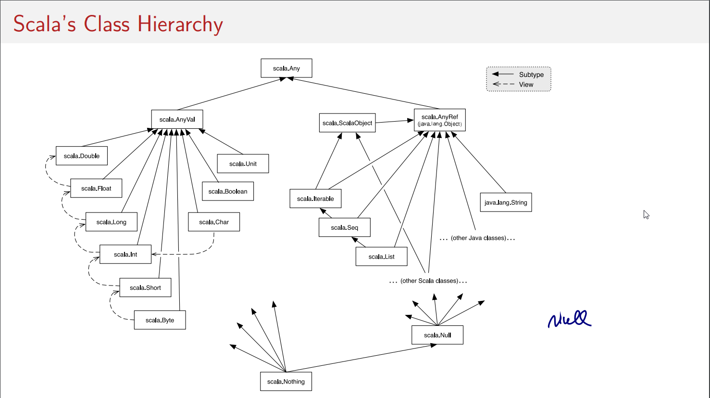

## Programming Paradigms

### Impreative Programming

Focus on the flow of instructions to execute

Main characteristics:
* Modifying mutable cariables,
* Using assignments
* and control structures (e.g. if, else, loops, break, return)

Strong correspondence between programming logic and how the PC "works"
* mutable variables ~= memory cells
* Variable dereferences ~= load instructions
* Variable assignments ~= store instructions
* Control structures ~= jumps


### Functional Programming

Focus on functions, how functions can  be abstracted, produced, consumed and composed.

Main characteristics:
* Functions considered as values
* Enables construction of elegant programs that focus on functions
* No mutable variables.
* No usage or reduced usage of assignments, loops and other imperative control structures
* Functions can be defined anywhere (including inside other functions) 
* There exist sets of oprators to compose functions

Getting popular because
- Provide better modularity
- Parallel-programming-friendly


#  Scala

Born in 2003. Is a functional AND object orientedlanguage


#### For parallelism

* Collections: Parallel Collections and Distributed Collections
* Parallel DSLs

```scala
class Person(val name: String, val age: Int)
val people: Array[Person]

// To partition an array of people in 2 arrays of minors and adults
val (minors, adults) = people partition(_.age < 18)

// To do the same in parallel
val (minors, adults) = people.par partition(_.age < 18)
```

#### For Concurrency

* Actors:
	* message-oriebted programming for multi-threading
	* Serialize accss to shared resources using queues and function passing.
* Software transational memory
* Futures


#### Expression Resolution

aritmetic order + lazy naming resolution + function arguments resolution

aka substitution mode: the idea behind this model is that all evalutaion dows is reduce an expression to a value. This model is formalized in the lambda-calculus

```scala
// Expressions resolution example, step by step
(2 * pi) * radius
(2 * 3.14159) * radius
6.28318 * radius
6.28318 * 10
62.8318
```

Function arguments resolution can be done with 2 strategy call-by-value (default) and call-by-name.
See an example of resolution for both cases

```scala
// Default call-by-value resolution
def square(x: Double) = x * x
def sumOfSquares(x: Double, y: Double) = square(x) + square(y)

sumOfSquares(3, 2+2)
sumOfSquares(3, 4)
square(3) + square(4)
3 * 3 + square(4)
9 + square(4)
9 + 4 * 4
9 + 16
25

// Forced call-by-name resolution (=> symbol)
def square(x: => Double) = x * x
def sumOfSquares(x: => Double, y: => Double) = square(x) + square(y)

sumOfSquares(3, 2+2)
square(3) + square(2+2)
3 * 3 + square(2+2)
9 + square(2+2)
9 + (2 + 2) * (2 + 2)
9 + 4 * (2 + 2)
9 + 4 * 4
9 + 16
25
```

### Primitive types and Built-in types

* **Int**: 32-bit integers
* **Double**: 64-bit gloating point numbers
* **Boolean**
* **Byte**
* **Short**
* **Long**
* **Float**
* **String**


#### Conditional expression if-else

syntax similar to Java but in scala is an expression and not a statement with a logic similar to the Java ternary operator

```scala
def abs(x: Int) = if (x >= 0) x else -x
```

#### Functions

Return value is not rquired to be explicit, except in the case you are defining a recursive function

#### Blocks

A block is delimited by braces `{ }`  that can contains a set of instructions.
If the last instruction is an expression, that expression result would be the return value.
Everything defined inside, is not available outside

#### Tail recursion

Recursive functions are the key to write algorithms very in line with the Functional Programming paradingm.

Said that, there is a particular kind of recursion called Tail recusion that - in practice - is equally to a classic iterative loop in imperative programming in terms of performances and memory usage.

In general, if the last action of a function consists of calling a function (which may be the same), one stack frame would be sufficient for both functions. Such calls are called tail-calls.
In "normal" recusive functions, one additional stack frame needs to be used for each recursive step.

```scala
/*
 * This is an example of tail recursive function because
 * its last and only instruction is calling itself (gcd(b, a % b))
 */
def gcd(a: Int, b: Int): Int =
	if (b == 0) a else gcd(b, a % b)

/*
 * This is NOT a tail recursive function becaus, as last instruction,
 * it call itself AND make a multiplication stays pending
 * and can be resolved only afer the reslut of nested call is also resolved.
 */
def factorial(n: Int): Int =
  if (n == 0) 1 else n * factorial(n - 1)

/*
 * This is an example of how we can refactor the previous non tail recusive factorial
 * into a tail recusive version
 */
def tail_recursive_factorial(n: Int): Int = {
  // loop is tail recursive because its only last step is calling itself
  def loop(acc: Int, n: Int): Int =
    if (n == 0) acc else loop(acc * n, n - 1)

  loop(0, n)
}
```

There is one annotation to force defininf a function as a tail recursive one `@@tailrec`.
If this annotation is applied to a non tail recursive function, the compilation will fail.

#### Currying //TODO

When you need to define a function that uses some of his arguments to define an retrurn another function, you have 2 possible syntaxes you can use.

```scala
def applyOperation(x: Int, y: Int, op: (Int, Int) => Int) = op(x, y)

def sum(x, y) = applyOperation((x, y) => x + y, x, y)
def division(x, y) = sum((x, y) => x / y, x, y)

def applyOperation(op: (Int, Int) => Int): (Int, Int) => Int =
	def _applyOperation op(x, y) = op(x,y)
    _applyOperations

def sum = sum((x, y) => x + y)
def division = sum((x, y) => x / y)

def applyOperation(op: (Int, Int) => Int)(x: Int, y: Int) : Int =
	op(x, y)

def sum = sum((x, y) => x + y)
def division = sum((x, y) => x / y)
```

#### Function precedence

The rule of thumb is that function are evauluated from left to right.
> **NOTE:** Operators ending in ":" are associated to the right.
> `val numList = 1 :: 2 :: Nill` is equal to `val numList = Nill.::(2).::(1)`
However this is not true if the identifier (name) of a function starts with symbols.

The precedence of an operator is determined by its first character.
The following table lists the characters in increasing order of priority
precedence:
(all letters) -> lowest precedence
|
^
&
< >
= !
:
+ -
* / %
(all other special characters) -> highest precdence

### Class

```scala
class Rational(x: Int, y: Int) {
	def numer = x
    def dnom = y
}
```

This definition introducs 2 entities:
- A new type, named Rational
- A constructor Rational to create elements of this type

Class instantiation

```sscala
new Rational(3, 4)
```

#### singletons

Singleton are classes that have can have only one instance.
In scala there is facilitated syntaxt for it and consists in defining an object

```scala
object MySingleton {
	// ...
}
val x = MySingleton
````

This declaration - at the same time - define a class and instanciate an object of that class - named MySingleton - and block the possibility of instanciating more objects of that class

#### traits

Traits resemble interfaces in Java, but are more powerful because they can contains fields and concrete methods.
They cannot have (value) parameters, only classes can

```scala
trait Planar {
	def height: Int
    def width: Int
    def surface = height * width
}
```

#### Subclasses

```scala
class Square extends Shape with Planar with Movable ... {
 // ...
}
```

### Main

2 Syntax possible.

**Java like**
```scala
object Main {
	def main(args: Array[String]) {
    	println("Hello World")
    }
}
```

**New Syntax**

```scala
object Main eztends App {
    println("Hello World")
}
```


### Class as Function

functions in scala are simply anonymous classes with an apply method defined.
For this reason, if we define an apply method in a whatever trait, it'll allow us to use the trait identificator in a function-fashion way.

```scala
//Defining a trait like this
trait MyTrait(property: Int) {
	// ... other trait code

	def apply(): String = {
    	// do something
    }
}

// You are then allowed to use the class as a function
val out = MyTrait()
// That will be converted in calling:
val out  = (new Trait {}).apply()
```


#### Require and assert

// TODO


### Scala's class Hierarchy

Interesting classes: Any, AnyVal, AnyRef === java.lang.Object, scala.ScalaObject, Null, Nothing.
Scheme:



### Polymorphism

Two principal forms of polymorphism:
* subtyping
* generics

Interactions between the 2 concepts:
- bounds
- variance

#### bounds

```scala
// upper bound - for Intset and its subtypes
def assertAllPos[S <: IntSet](r: S): S = //...

// lower bound - for Intset and its supertypes
def assertAllPos[S >: IntSet](r: S): S = //...
```

#### variance

// TODO covariance if we have a nested type that changes, like List[T <: Object]

```scala
// Covariance is valid for Java Arrays. These 2 lines are valid java code
Integer[] a = new Integer[]{1, 2}
Object[] b = a

// Covariance is not valid for scala arrays. These 2 lines are not valid scala code
val a: Array[Int] = Array[Int](1, 2)
val b: Array[Object] = a
```

a function `(A1) => B1` is a subtype of a function `(A2) => B2`; if:
- A2 <: A1
- B1 <: B2

### Pattern Matching

Pattern matching is a generalization of `switch` from C/Java to class hierarchies.
It's expressed in Scala using the keyword match.

```java
myObject match {
	case Int => println("I'm an Integer")
    case String => println("I'm an String")
} 
```

A MatchError exception is thrown if no pattern matches


### Lists vs Arrays

````scala
val aList = List(1, 2, 3)	// Immutable
val anArr = Array(1, 2, 3)	// Mutable
```

#### Useful list methods and elements

* xs.length : length of the list
* xs.last : last list item (exception if list empty)
* xs.init : remove last element from list (exception if list empty)
* xs take n : take the first n (or all if the list is smaller than n) elements from the list
* xs drop n : remove the first n elements from the list
* xs(n) : get the element in nth position
* xa ::: ys : concatenate lists. Operator is right associative and more effiecient for this specific operation.
* xs ++ ys : concatenate lists (or any collection), more flexible but less efficient left associative concatenation.
* xs.revers : returns reversed list
* xs updated (n, x) : return a copy of xs with only the nth changed to be x
* xs indexOf x : finds x in xs
* xs contains x : true if x is part of xs

#### Common trasnformations on lists
* Map
* Filter
* partition
* takeWhile, dropWhile, span
* reduceLeft(operation), reduceRight
* foldLeft, foldRight
* sum, product

### others
* `xs exists p` true if there is an element x of xs such that p(x) holds, false otherwise.
* `xs forall p` true if p(x) holds for all elements x of xs, false otherwise.
* `xs zip ys` A sequence of pairs drawn from corresponding elements of sequences xs and ys.
* `xs.unzip` Splits a sequence of pairs xs into two sequences consisting of the first, respectively second halves of all pairs.
* `xs.flatMap` f Applies collection-valued function f to all elements of xs and concatenates the results
* `xs.sum` The sum of all elements of this numeric collection.
* `xs.product` The product of all elements of this numeric collection
* `xs.max` The maximum of all elements of this collection (an Ordering must exist)
* `xs.min` The minimum of all elements of this collection


### Other Sequences

#### Iterable

Is the base class for Seq, Set, Map

#### Seq and Iterable

Seq is the base class of all sequences (i.e. List, Vector).
Arrays and Strings can access all common sequences methods even if they do not extend the Seq classs.

#### Vectors

Array of 32 elem 2^5.
if contains more than 32 elem, the array becomes an array of pointers to other 32-sized arrays of elements -> 2^10 element.
And same goes on if you need more than 2^10 elements.
- Access time is log(32, n)
- Good for bulk operators like (map and foreach)
- 32-size vector are good matches for modern CPU cache and often they can occupy the same cache region and being loaded at once (good loading performance)

Operations:
- Do not support x :: xs operation
- insted, x +: xs is usable

```scala
val nums = Vector(1, 2, 3, -88)
```

#### Ranges

Ranges implement Seq

A range represents a sequence of evenly spaced integers.
`to` (inclusive), `until` (exclusive), `by` (to determine step value):

Ranges are represented as single objects with three fields: lower bound, upper bound, step value.

```scala
val r: Range = 1 until 5
val s: Range = 1 to 5
1 to 10 by 3
6 to 1 by -2
```

### Implicit

// TODO